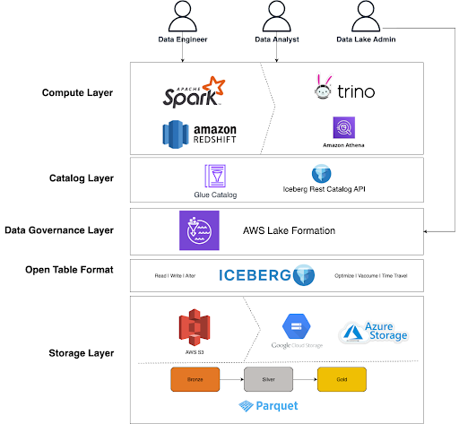

# Iceberg Data Lakehouse

A comprehensive data lakehouse solution using Apache Iceberg, Spark, and Docker for efficient data engineering and analytics workflows.



## 🏗️ Architecture

This project implements a modern data lakehouse architecture with:
- **Apache Iceberg** for table format and ACID transactions
- **Apache Spark** for distributed processing
- **Docker** for containerized deployment
- **AWS Glue Catalog** for metadata management
- **S3** for data storage
- **Jupyter Notebooks** for interactive development

## 📋 Prerequisites

Before setting up the project, ensure you have the following installed:

- **Docker** (version 20.0 or later)
- **Docker Compose** (version 2.0 or later)
- **Git** for version control

### System Requirements
- **RAM**: Minimum 8GB (16GB recommended)
- **Storage**: At least 10GB free space
- **Network**: Internet connection for downloading Docker images

## 🚀 Quick Start

### 1. Clone the Repository

```bash
git clone https://github.com/vermaatul9565/Iceberg-Data-Lakehouse.git
cd Iceberg-Data-Lakehouse
```

### 2. Environment Configuration

Create a `.env` file in the root directory with your AWS credentials (if using AWS Glue Catalog):

```bash
# Create .env file
cat > .env << EOL
AWS_ACCESS_KEY_ID=your_access_key_here
AWS_SECRET_ACCESS_KEY=your_secret_key_here
AWS_DEFAULT_REGION=ap-south-1
EOL
```

> **Note**: Replace `your_access_key_here` and `your_secret_key_here` with your actual AWS credentials.

### 3. Build and Start Services

```bash
# Build and start all services
docker-compose up -d

# View logs (optional)
docker-compose logs -f
```

### 4. Access the Services

Once the containers are running, you can access:

- **Jupyter Notebooks**: http://localhost:8888
- **Spark UI**: http://localhost:4041
- **Iceberg REST Catalog**: http://localhost:8181

## 📁 Project Structure

```
Iceberg-Data-Lakehouse/
├── docker-compose.yml          # Docker services configuration
├── spark-defaults.conf         # Spark configuration
├── config/
│   ├── __init__.py
│   └── spark.py               # Spark session configurations
├── notebooks/                 # Jupyter notebooks
│   ├── DE_Spark_iceberg.ipynb # Data Engineering examples
│   ├── DS_workbook.ipynb      # Data Science workflows
│   └── SQL_iceberg.ipynb      # SQL operations
├── warehouse/                 # Local Iceberg warehouse
└── README.md
```

## 🔧 Configuration Options

The project supports three catalog configurations:

### 1. Local Hadoop Catalog (Default)
- Uses local filesystem for metadata
- Best for development and testing
- No external dependencies

### 2. AWS Glue Catalog
- Integrates with AWS Glue Data Catalog
- Production-ready metadata management
- Requires AWS credentials

### 3. REST Catalog
- Uses Iceberg REST catalog server
- Suitable for multi-user environments
- Centralized metadata management

## 💻 Usage Examples

### Creating a Spark Session

```python
from config.spark import SparkIcebergConfig

# For local development
spark = SparkIcebergConfig.create_session("local")

# For AWS Glue integration
spark = SparkIcebergConfig.create_session("glue")

# For REST catalog
spark = SparkIcebergConfig.create_session("rest")
```

### Basic Data Operations

```python
# Create a namespace/database
spark.sql("CREATE SCHEMA IF NOT EXISTS bronze")

# Load data from CSV
df = spark.read.option("header", "true").csv("path/to/data.csv")

# Write to Iceberg table
df.writeTo("catalog.bronze.my_table").createOrReplace()

# Query data
spark.sql("SELECT * FROM catalog.bronze.my_table").show()
```

## 🔍 Available Notebooks

1. **DE_Spark_iceberg.ipynb**: Data Engineering workflows with medallion architecture
2. **DS_workbook.ipynb**: Data Science and analytics examples
3. **SQL_iceberg.ipynb**: SQL-based data operations
4. **test.ipynb**: Testing and experimentation

## 🛠️ Troubleshooting

### Common Issues

1. **Port Conflicts**
   ```bash
   # Check if ports are in use
   lsof -i :8888 -i :4041 -i :8181
   
   # Stop conflicting services or modify ports in docker-compose.yml
   ```

2. **Memory Issues**
   ```bash
   # Increase Docker memory allocation in Docker Desktop settings
   # Recommended: 8GB or more
   ```

3. **Permission Issues**
   ```bash
   # Fix warehouse directory permissions
   sudo chmod -R 755 warehouse/
   ```

4. **AWS Credentials**
   ```bash
   # Verify AWS credentials
   docker-compose exec spark-iceberg env | grep AWS
   ```

### Logs and Debugging

```bash
# View service logs
docker-compose logs spark-iceberg
docker-compose logs rest

# Access Spark container
docker-compose exec spark-iceberg bash

# Restart services
docker-compose restart
```

## 🔄 Stopping the Environment

```bash
# Stop all services
docker-compose down

# Stop and remove volumes (caution: data loss)
docker-compose down -v

# Remove images (optional)
docker-compose down --rmi all
```

## 🤝 Contributing

1. Fork the repository
2. Create a feature branch (`git checkout -b feature/amazing-feature`)
3. Commit your changes (`git commit -m 'Add some amazing feature'`)
4. Push to the branch (`git push origin feature/amazing-feature`)
5. Open a Pull Request

## 📄 License

This project is licensed under no License.

## 🙏 Acknowledgments

- Apache Iceberg community for the excellent table format
- Tabular.io for Docker images and inspiration
- Apache Spark community for the distributed processing engine

## 📞 Support

If you encounter issues or have questions:
Reach out via email or GitHub discussions.
---

**Happy Data Engineering!** 🎉